# Laporan Praktikum Basis Data - Pertemuan 1

Nama: Regina Aulia Wijayani  
NIM: 25430034  
Kelas: B 
Pertemuan: 01 
Tanggal: 2 Oktober 2026 
Nama Dosen: Dedi Irawan, S.Kom., M.T.I. 

## 1. Tujuan Praktikum
1. Memastikan MariaDB di XAMPP bisa jalan normal di laptop.
2. Belajar dasar-dasar perintah terminal MariaDB, mulai dari bikin database baru sampai atur hal akses user.
3. Membiasakan diri pakai Git buat nyimpen progress tugas dan tahu cara nyembunyiin data rahasia biar nggak bocor ke repo publik.

## 2. Ringkasan Dasar Teori
Intinya basis data itu tempat ngumpulin data biar saling nyambung dan gampang dibuka bareng-bareng tanpa takut datanya rusak atau tumpang tindih. Biar nggak repot ngatur penyimpanan manual atau mikirin cara balikin data pas mati lampu, kita dibantu sama software pengelola yang namanya DBMS (Database Management System). Jadi kita tinggal minta data yang dimau pakai perintah SQL.

Cara kerja MariaDB sendiri pakai konsep klien-server. Mesin servernya (mysqld) standby terus di port 3306, nungguin perintah yang kita kirim lewat aplikasi klien kayak terminal CLI atau phpMyAdmin. Kalau ada pesan tidak dapat terhubung, berarti servernya belum nyala. Tapi kalau muncul tulisan ERROR lengkap sama kode angkanya, itu tandanya koneksi udah tembus tapi perintah query kita yang salah atau ditolak server.

Di praktikum ini kita pakai XAMPP karena praktis; server web, database, sama PHP udah langsung sepaket tinggal klik tombol Start. Walaupun versi MariaDB bawaan XAMPP ini cocok banget buat latihan di lab lokal, sistem begini nggak boleh dipakai buat server online sungguhan karena aspek keamanannya memang diset longgar buat pemula. Kita juga diwajibkan terbiasa pakai Command Line (CLI) ketimbang klik-klik di phpMyAdmin, soalnya perintah teks di terminal gampang disalin jadi skrip, bisa di-tracking lewat Git, dan bakal jadi standar utama pas kerja di server beneran nanti.

Soal keamanan, MariaDB ngebaca identitas user lewat kombinasi nama akun dan asalnya (user@host). Karena akun bawaan root di XAMPP nggak dipasangi password, kita wajib nerapin prinsip least privilege, yaitu bikin akun baru yang haknya dibatasi cuma buat satu database kerjaan aja biar aman. Terakhir, semua riwayat penulisan skrip SQL dan laporan dipantau pakai Git lewat alur commit dan push, jadi bukti pengerjaan tugas kita tersimpan rapi dan ketahuan bertahap dari awal sampai selesai.

## 3. Hasil Langkah Percobaan
### D.1 Menjalankan Layanan MariaDB

Keterangan: jadi tangkap layar XAMPP control panel v.3.3.0 ini itu nunjukin kalau modul Apache dan mysql nya udah sukses nyalain dan berstatus running berwarna hijau. Bagianlogin di bawah juga memastikan semua proses berjalan lancar tanpa kendala.

### D.2 Masuk Melalui Klien Baris Perintah

Keterangan: 1. masuk ke MariaDB melalu shell XAMPP sebagai root.
            2. mengecek versi MariaDB dan user yang digunakan.
            3. koneksi berhasil sebagai root@localhost.
            4. mengecek database yang tersedia.
            5. MariaDB siap digunakan untuk praktium.

### D.3 Mengamankan Akun Root

Keterangan: bagian ini dilakukan pengecekan akun root yang ada di MariaDB. Habis itu akun root di kasih password biar lebih aman. Kemudian keluar dan login kembali pake password yang tadi udah di buat untuk memastikan akun sudah berhasil diamankan.

### D.4 Membuat Basis Data dan Akun Kerja

Pada gambar yang udah saya cantumin diatas terlihat proses login ke mariadb menggunakan user mhs_34. setelah berhasil masuk, dilakukan perintah SHOW DATABASES; dan hanya database informasi_schema yang terlihat. saat mencoba mengakses database mysql dengan perintah USE mysql; muncul ERROR 1044(42000) yang berarti user mhs_34 tidak memiliki hak akses untuk menggunakan database tersebut.

### D.5 Menggunakan phpMyAdmin Dengan Aman
![gunakanphpmyadmin]

### D.6 Menyiapkan Repositori Git
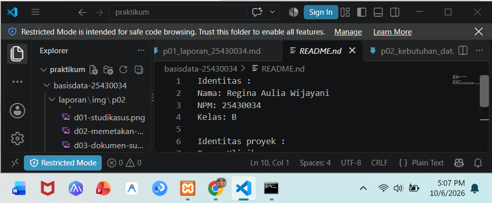
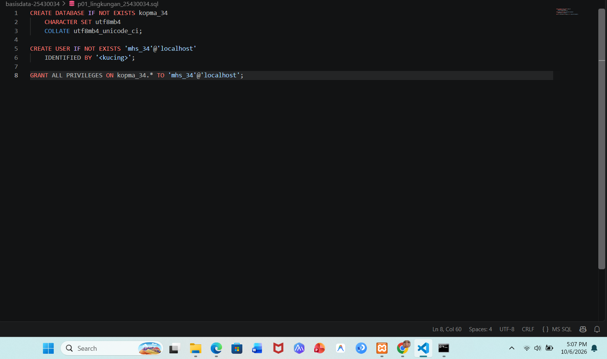

## 4. Jawaban Titik Analisis
### Titik Analisis 1
Walaupun di XAMPP tertulis Mysql, tapi sebenernya yang berjalan adalah MariaDB. Dokumentasi Mysql masih bisa di pake untuk perintah umum, tapi kalo untuk fitur khusus lrbih baik lihat dari dokumentasi MariaDB.

### Titik Analisis 2
Dibagian "user password: NO" menunjukkan kalo kita mencoba login tanpa mengirim password. Karna akun root udah dikasih password, login yang tadi akhirnya di tolak sama bagian server.

### Titik Analisis 3
mhs_34 maish bisa melihat information_schema karna database tersebut berisi informasi yang bisa diakses user. Error 1044 berarti tidak punya izin ke database, sedangkan 1045 berarti login atau autentikasinya gagal.

### Titik Analisis 4
Mode cookie lebih aman karna password nya tidak disimpan di file konfigurasi. Password harus dimasukkan pada saat login, berbeda dengan mode config yang menyimpan password di file.

## 5. Hasil Latihan dan Modifikasi
### E.1
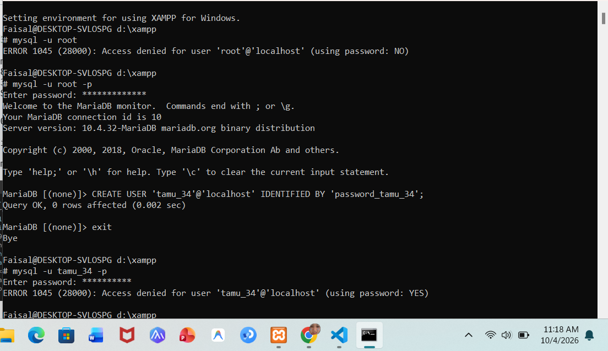

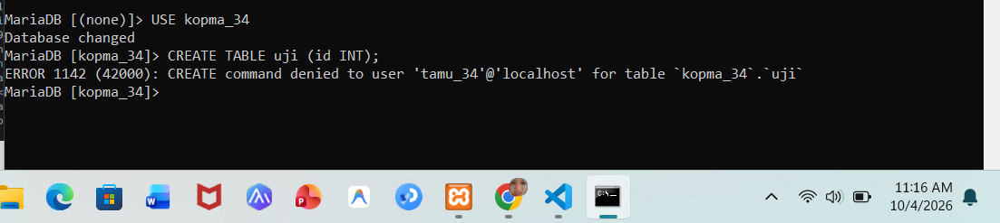

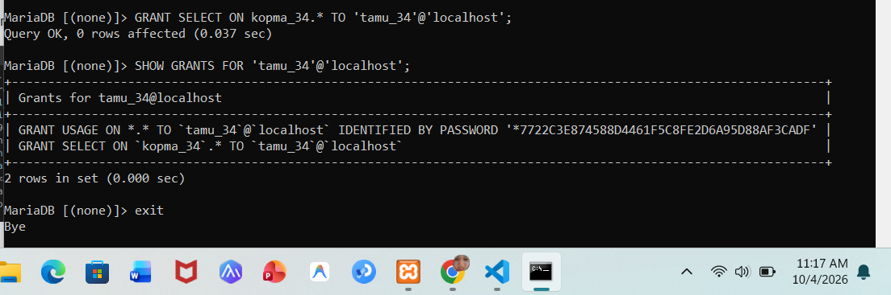

### E.2
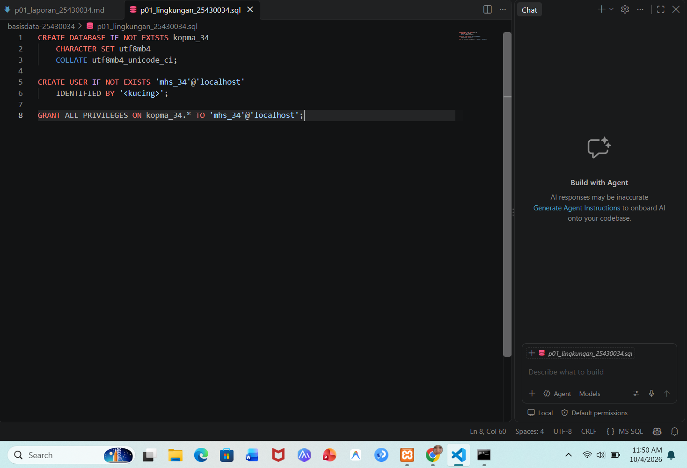

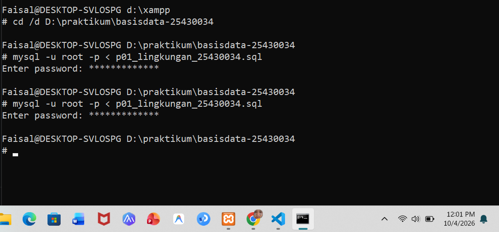

## 6. Tugas Mandiri: Milestone Proyek 1
### F.1 dan F.2
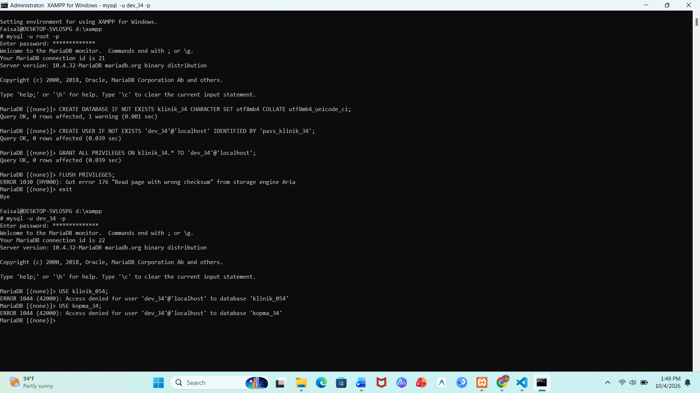

### F.3
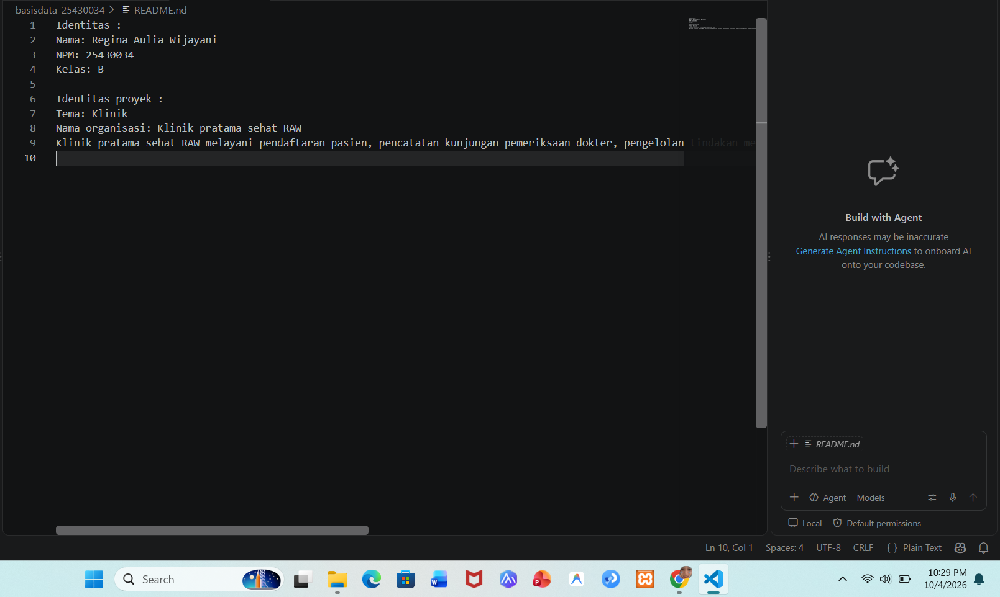

### F.4
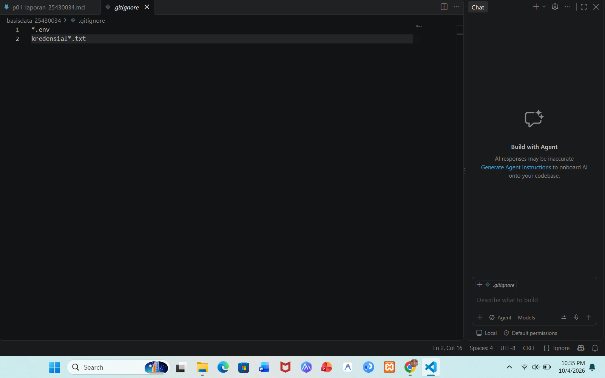

### F.5
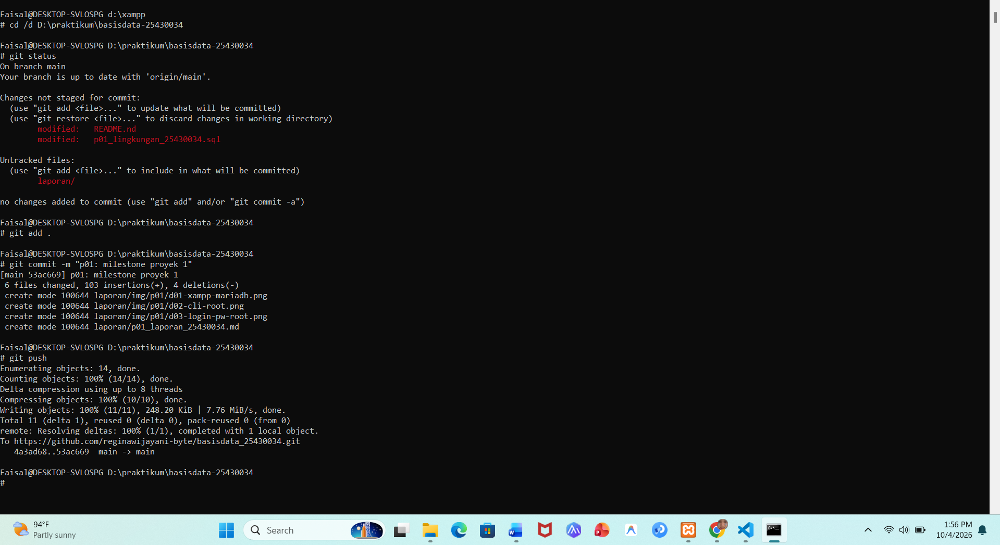

## 7. Pembahasan dan Kendala
1. Sekarang setiap mau start MYsql selalu error terus, tapi sebelum-sebelum nya tidak yang terlalu banyak error nya.
2. sekarang-sekarang ini setiap udah masuk ke shell terus saya mau enter kursurnya tidak jalan atapun di bawah nya tidak ada lanjutannya dan tidak ada tulisan MariaDB (none). 

## 8. Kesimpulan
Dari praktikum pertama ini saya lebih paham gimana cara meniapkan MariaDB melalu XAMPP, mengatur akun dan hak akses, serta menggunakan phpmyadmindan github. saya juga jadi lebih ngerti pentingnya mengamankan akun database dan menyimpan hasil kerja dengan git biar lebih rapih dan lebih gampang di cek. Praktikum ini juga menjadi dasar untuk melanjutkan materi database di praktikum berikutnya.

## 9. Pernyataan Penggunaan AI
Saya pake ChatGPT dan Gemini buat membantu memahami materi praktikum, menjelaskan beberapa pesan error, dan merapihkan bahasa di laporan yang lagi aku buat ini. Hail praktik, screenshot, dan pekerjaan yang di kumpulin merupakan hasil pengerjaan saya sendiri tapi ya ada sedikit di bantu AI nya buat nagsih tau gimana-gimana cara nya.

## 10. Bukti Git

Repository: https://github.com/reginawijayani-byte/basisdata_25430034

Commit: 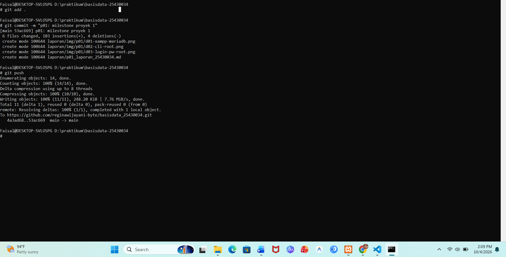

## Checklist

- [ ] D.1–D.6 selesai
- [ ] Titik Analisis 1–4 dijawab
- [ ] E.1–E.2 selesai
- [ ] Milestone Proyek 1 selesai
- [ ] Bukti screenshot lengkap
- [ ] Git commit dan push