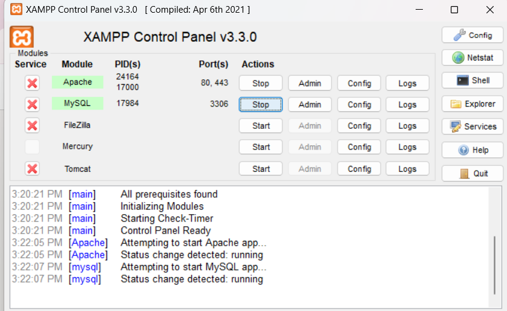
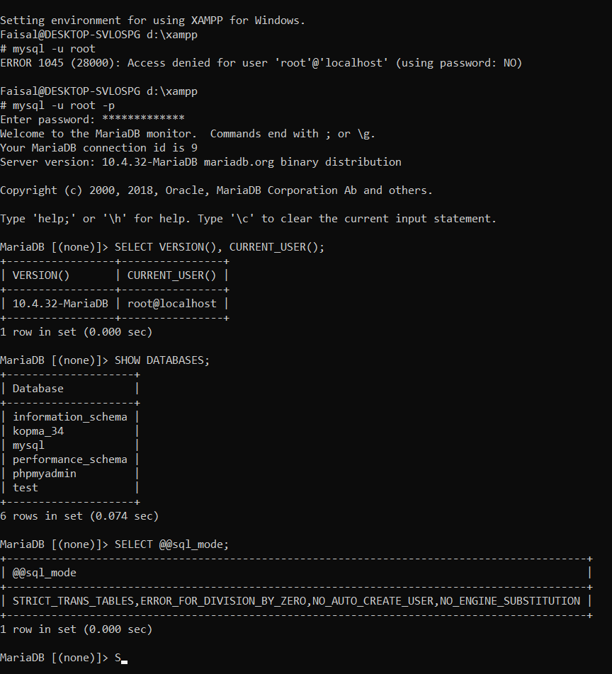
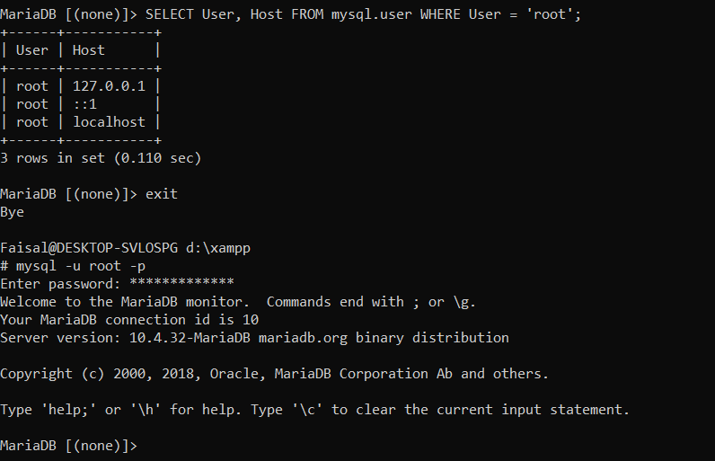

# Laporan Praktikum Basis Data - Pertemuan 1

Nama: Regina Aulia Wijayani  
NIM: 25430034  
Kelas: B 
Pertemuan: 01 
Tanggal: 2 Oktober 2026 
Nama Dosen: Dedi Irawan, S.Kom., M.T.I. 

## 1. Tujuan Praktikum

1. Memastikan MariaDB di XAMPP bisa jalan normal di laptop.
2. Belajar dasar-dasar perintah terminal MariaDB, mulai dari bikin database baru sampai atur hal akses user.
3. Membiasakan diri pakai Git buat nyimpen progress tugas dan tahu cara nyembunyiin data rahasia biar nggak bocor ke repo publik.

## 2. Ringkasan Dasar Teori

Intinya basis data itu tempat ngumpulin data biar saling nyambung dan gampang dibuka bareng-bareng tanpa takut datanya rusak atau tumpang tindih. Biar nggak repot ngatur penyimpanan manual atau mikirin cara balikin data pas mati lampu, kita dibantu sama software pengelola yang namanya DBMS (Database Management System). Jadi kita tinggal minta data yang dimau pakai perintah SQL.

Cara kerja MariaDB sendiri pakai konsep klien-server. Mesin servernya (mysqld) standby terus di port 3306, nungguin perintah yang kita kirim lewat aplikasi klien kayak terminal CLI atau phpMyAdmin. Kalau ada pesan tidak dapat terhubung, berarti servernya belum nyala. Tapi kalau muncul tulisan ERROR lengkap sama kode angkanya, itu tandanya koneksi udah tembus tapi perintah query kita yang salah atau ditolak server.

Di praktikum ini kita pakai XAMPP karena praktis; server web, database, sama PHP udah langsung sepaket tinggal klik tombol Start. Walaupun versi MariaDB bawaan XAMPP ini cocok banget buat latihan di lab lokal, sistem begini nggak boleh dipakai buat server online sungguhan karena aspek keamanannya memang diset longgar buat pemula. Kita juga diwajibkan terbiasa pakai Command Line (CLI) ketimbang klik-klik di phpMyAdmin, soalnya perintah teks di terminal gampang disalin jadi skrip, bisa di-tracking lewat Git, dan bakal jadi standar utama pas kerja di server beneran nanti.

Soal keamanan, MariaDB ngebaca identitas user lewat kombinasi nama akun dan asalnya (user@host). Karena akun bawaan root di XAMPP nggak dipasangi password, kita wajib nerapin prinsip least privilege, yaitu bikin akun baru yang haknya dibatasi cuma buat satu database kerjaan aja biar aman. Terakhir, semua riwayat penulisan skrip SQL dan laporan dipantau pakai Git lewat alur commit dan push, jadi bukti pengerjaan tugas kita tersimpan rapi dan ketahuan bertahap dari awal sampai selesai.

## 3. Hasil Langkah Percobaan

### D.1 Menjalankan Layanan MariaDB

### D.2 Masuk Melalui Klien Baris Perintah

### D.3 Mengamankan akun root

## 4. Jawaban Titik Analisis

### Titik Analisis 1

...

## 5. Hasil Latihan dan Modifikasi

### E.1

### E.2

## 6. Tugas Mandiri: Milestone Proyek 1

...

## 7. Pembahasan dan Kendala

...

## 8. Kesimpulan

...

## 9. Pernyataan Penggunaan AI

...

## 10. Bukti Git

**Repository:** ...

**Commit:** ...

## Checklist

- [ ] D.1–D.6 selesai
- [ ] Titik Analisis 1–4 dijawab
- [ ] E.1–E.2 selesai
- [ ] Milestone Proyek 1 selesai
- [ ] Bukti screenshot lengkap
- [ ] Git commit dan push