# Laporan Praktikum Basis Data - Pertemuan 02

Nama: Regina Aulia Wijayani 
NIM: 25430034 
Kelas: B  
Tanggal: 05 oktober 2026
Nama Dosen: Dedi Irawan, S.Kom., M.T.I.

## 1. Tujuan Praktikum
Pada praktikum kedua ini saya belajar menganalisis kebutuhan data dari sebuah organisasi. Analisis di lakukan dengan melihat aktivitas, aktor, proses bisnis, dokumen sumber, dengan data yang dibutukan. Selain itu. saya juga belajar membuat entitas kandidat, aturan bisnis, kebutuhan informasi, matriks CRUD, dan kamus data awal. Semua bagian tersebut masuk ke tahap pembuatan ERD pada praktikum berikutnya.

## 2. Ringkasan Dasar Teori
Analisis kebutuhan adalah tahap awal sebelum membuat rancangan database. ditahap inikita harus mengetahui duku proses yang berjalan dan data apa saja yang dibutuhkan. kebutuhan data bisa didapat dari wawancara, melihat proses kerja, dokumen, atau sistem yang sudah ada. selain itu, data juga harus punya aturan yang jelas, siapa yang bertanggung jawab, dan siapa yang boleh mengaksesnya. matriks CRUD digunakan untuk melihat proses mana yang membuat, membaca, mengubah, atau menghapus data.

## 3. Hasil Langkah Percobaan
### D.1 Membaca Studi Kasus
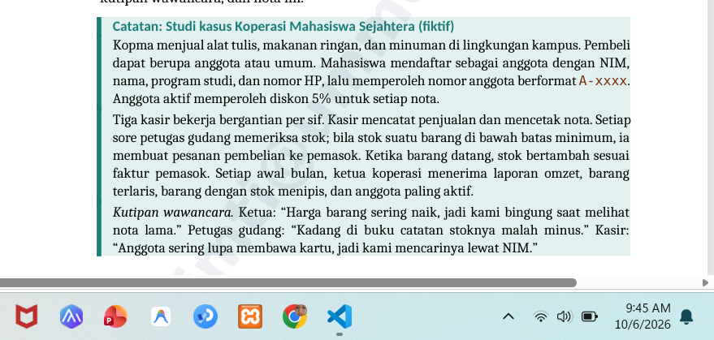

### D.2 Memetakan Aktor dan Aktivitas
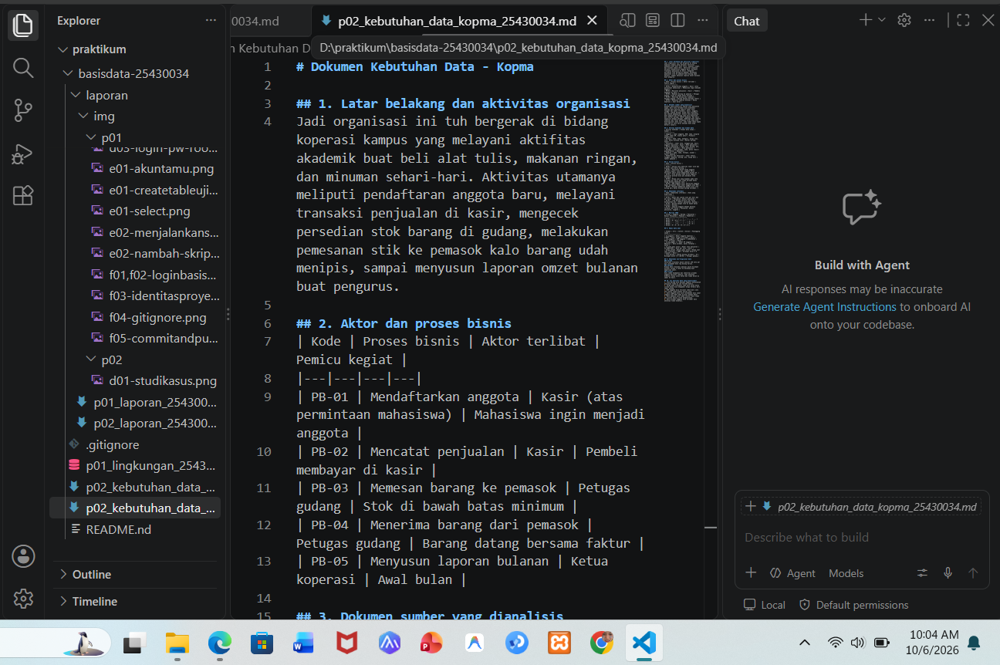
Menjelaskan kegiatan utama kopma, seperti pendaftaran anggota, penjualan barang, pengecekan stok, pemesanan barang, dan pembuatan laporan bulanan. Menjelaskan pihak yang terlibat dalam kegiatan kopma serta proses yang mereka lakukan, seperti kasir, petugas gudang, dan ketua koprasi.

### D.3 Membedah Dokumen Sumber
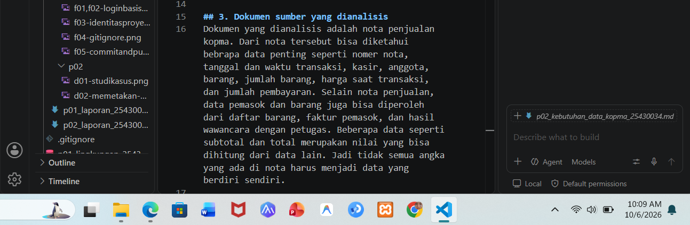
Bagian ini membahaskan sumber data yang digunakan, seperti nota penjualan, daftar barang, dan faktur pemasok. dari dokumen yang di atas dapat diketahui data penting seperti nomer nota, tanggal transaksi, barang, jumlah, harga, dan total pembayaran.

### D.4 Menurunkan Entitas Kandidat dan Aturan Bisnis
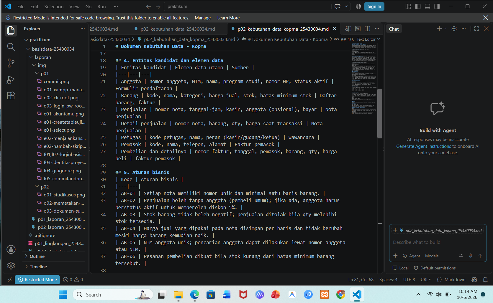
Bagian ini membahas entitas yang dibutuhkan dala sistem kopma beserta data yang ada didalamnya, seperti anggota, barang, penjualan, detail penjualan, petugas, pemasok, dan pembelian. Bagian aturan bisnis menjelaskan aturan yang harus diterapkan dalam kegiatan kopma, seperti nomer nota harus unik, stok tidak boleh negatif, harga transaksi harus disimpan, serta pemesanan barang dilakukan saat stok sudah di bawah batas minimum.

### D.5 Kebutuhan Informasi dan Matriks CRUD
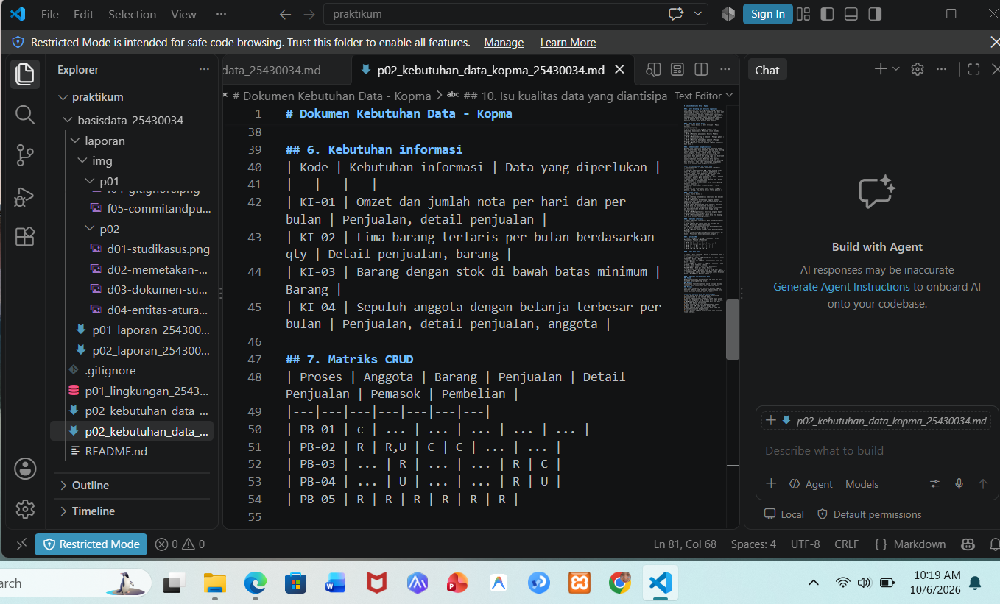
Bagian ini menjelaskan informasi yang dibutuhkan kopma, seperti omzet, barang terlaris, stok barang, dan anggota dengan belanja terbesar. selain itu, terdapat matriks CRUD yang menunjukan hubungan antara proses bisnis dengan data yang digunakan, seperti data yang di buat, dibaca, atau diperoleh.

### D.6 Kamus Data Awal dan Kebutuhan Non-Fungsional
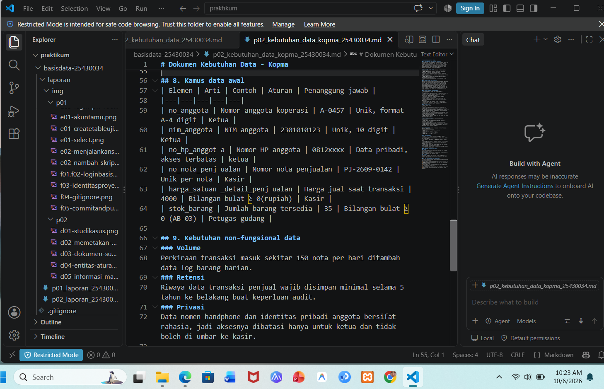
Bagian ini menjelaskan data yang digunakan dalam sistem kopma beserta arti, contoh, aturan, dan penanggung jawabnya. selain itu, dijelaskan juga kebutuhan non-fungsional seperti perkiraan jumlah transaksi, lama penyimpanan data, serta keamanan dan batasan akses terhadap data pribadi anggota.

### D.7 Menulis Dokumen Kebutuhan Data
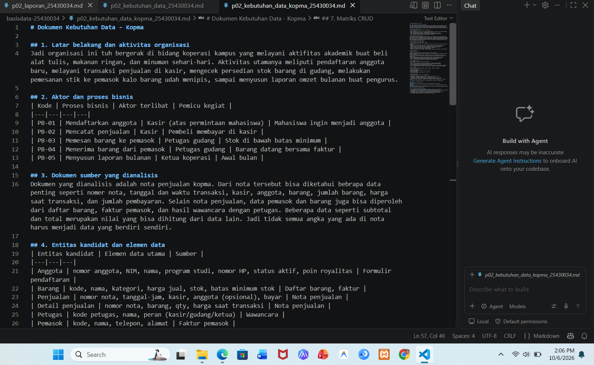
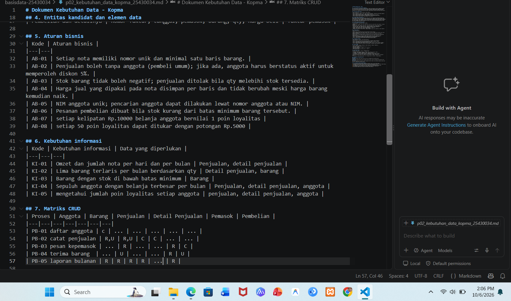
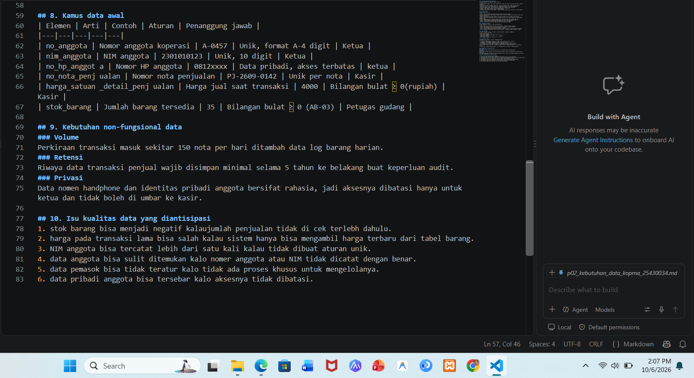

## 4. Jawaban Titik Analisis
### titik analisis 1
harga pada barang bisa berubah, sedangkan harga di transaksi lama harus tetap sesuai dengan harga saat pembelian. jadi harga saat transaksi perlu disimpan di detail penjualan biar riwayat transaksi tidak ikut berubah.
### titik analisis 2
subtotal dan total sebenernya bisa dihitung dari jumlah barang, harga, dan diskon. jadi tidak harus disimpan. tapi total tetap bisa disimpan kalo memang dibutuhkan sebagai catatan hasil transaksi.
### titik analisis 3
kalo entitas pemasok tidak mempunyai proses C. berarti belum ada proses yang membuat data pemasok. solusinya bisa menambahkan proses seperti mengelola data pemasok. kalo emang data pemasok tidak diperlukan, entitas tersebut bisa dipertimbangkan untuk di hapus.

## 5. Hasil Latihan dan Modifikasi
### E.1 Memberi poin loyalitas, elemen data, aturan bisnis,kebutuhan informasi dan CRUD
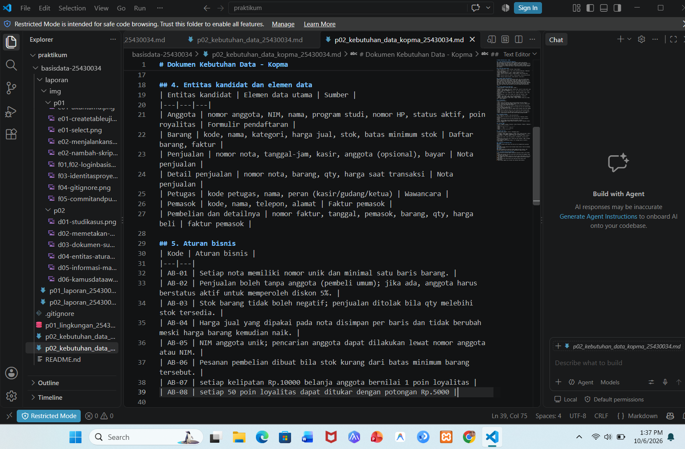
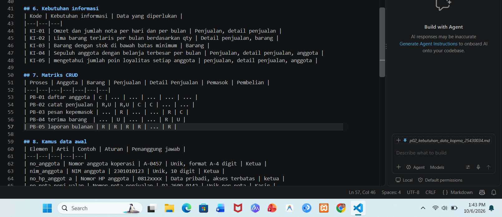

### E.2 perbaikan tiga pernyataan
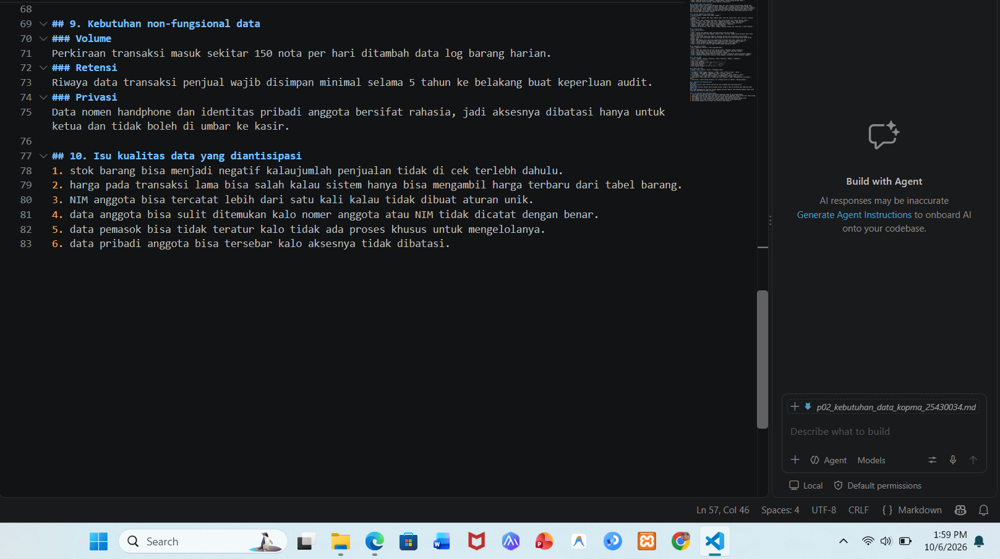

## 6. Tugas Mandiri: Milestone Proyek 2
### F.1 proses bisnis, entitas kandidat, aturan bisnis, kebutuhan informasi
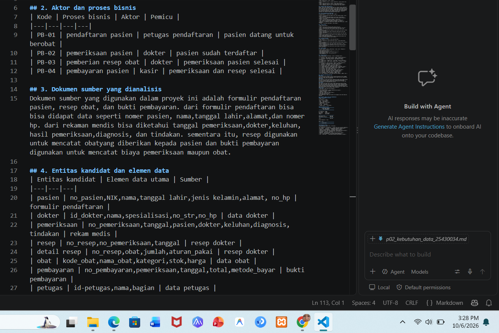

### F.2 Matriks CRUD 
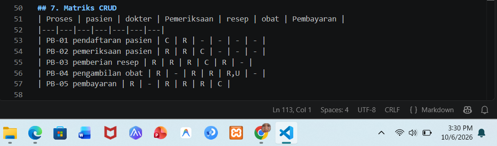

### F.3 Kamus data awal 
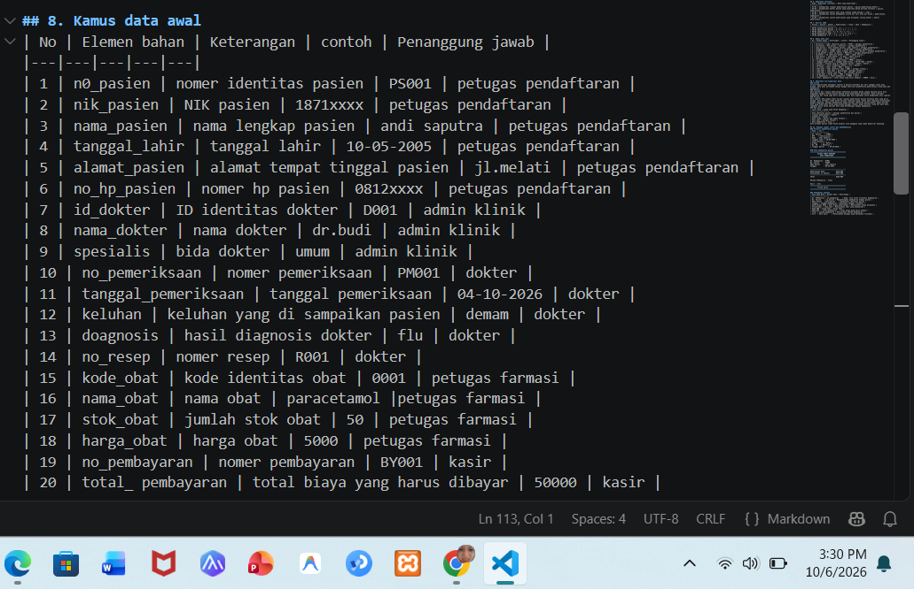

### F.4 Kebutuhan non-fungsional
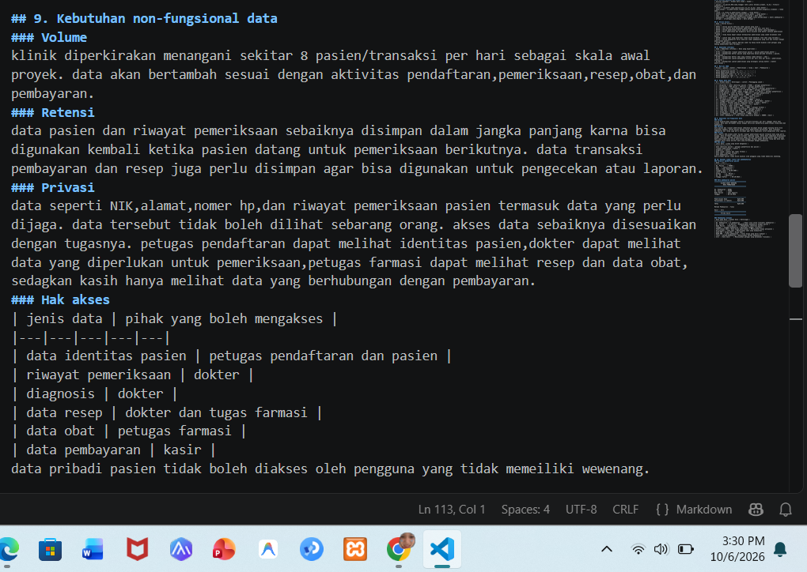

### F.5 Bukti nota
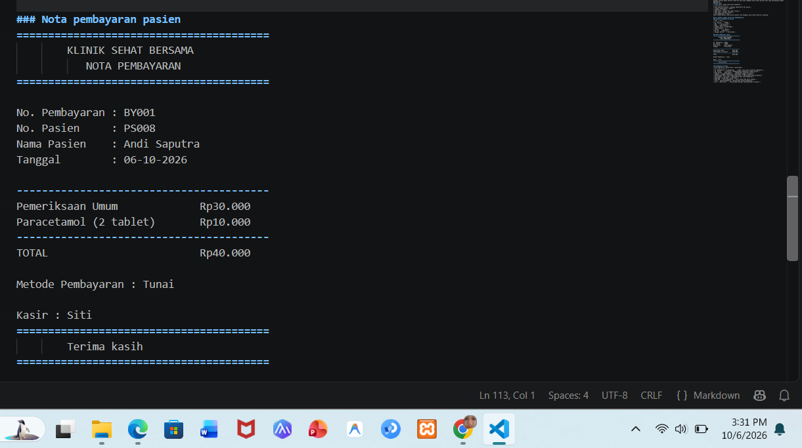

## 7. Pembahasan dan Kendala
Pada praktikum ini saya jadi lebih paham bahwa sebelum membuat database, kita harus mengetahui dulu kebutuhan datanya. dari proses bisnis yang ada, kita bisa menentukan data apa saja yang diperlukan dan aturan yang harus diterapkan.
kendala yang saya alami adalah menentukan entitas dan hubungan antara proses dengan data, terutama saat membuka matriks CRUD. setelah melihat proses bisnisnya satu per satu, penentuan data jadi lebih mudah.

## 8. Kesimpulan
dari praktikum kedua ini saya jadi lebih paham cara menganalisis kebutuhan data sebelum membuat database. saya belajar menentukan aktor,proses bisnis,entitas,aturan bisnis,kebutuhan informasi,matriks CRUD,dan kamus data. menurut aku tahap ini cukup penting biar database yang dibuat nantinya sesuai dengan kebutuhan dan proses yang ada.

## 9. Pernyataan Penggunaan AI
disini saya menggunakan chatgpt dan gemini yaitu untuk membantu memahami materi praktikum, menjelaskan beberapa konsep, dan merapikan bahasa pada laporan. hasil pekerjaan tetep saya yang mengerjakan ya mungkin ada sedikit tanya chatgpt dan gemini dan tetap saya sesuaikan dengan materi parktikum.

## 10. Bukti Git

## Checklist